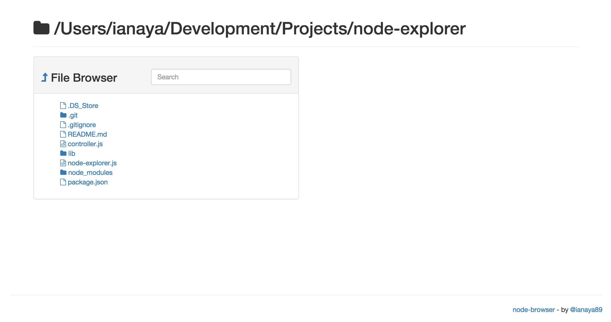

# node-explorer

A file explorer in your browser served with NodeJS

[](http://badge.fury.io/js/node-explorer)


### Installation
Open your terminal and type:
```
  npm install -g node-explorer
```

### Usage
Open your terminal and navigate to the desired root folder, then type:
```
  node-explorer
```

You can also set the port number that you want:
```
  node-explorer -p 3000
```

<p style="text-align: center">
  
</p>
___
See it on [NPM]().
